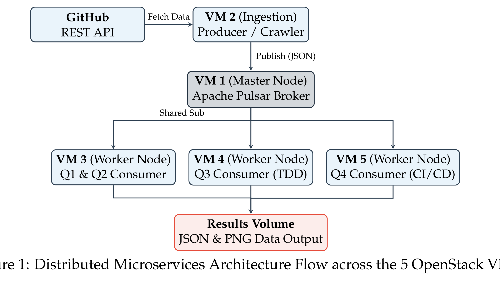
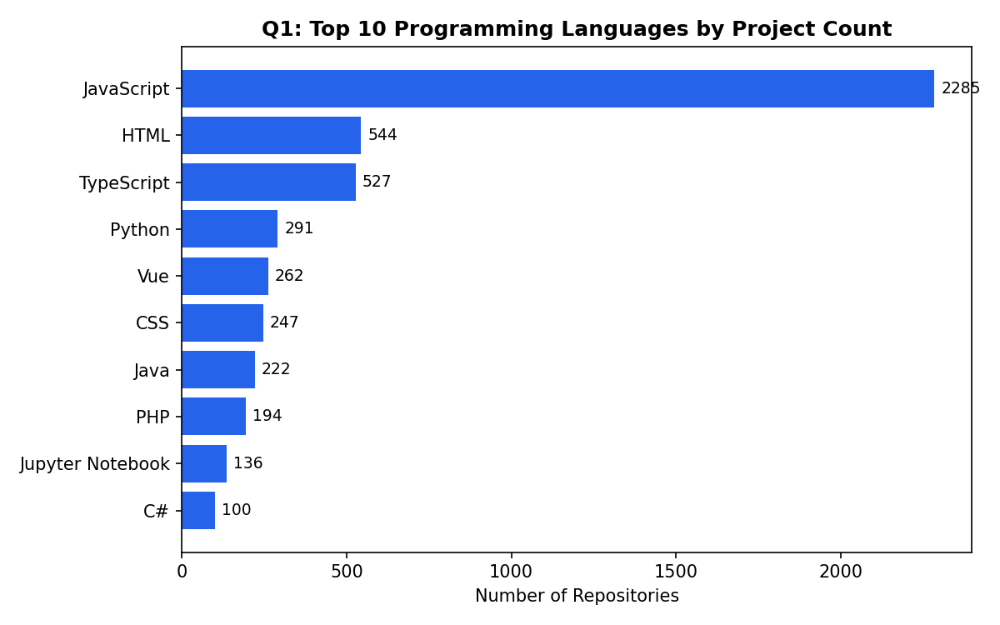
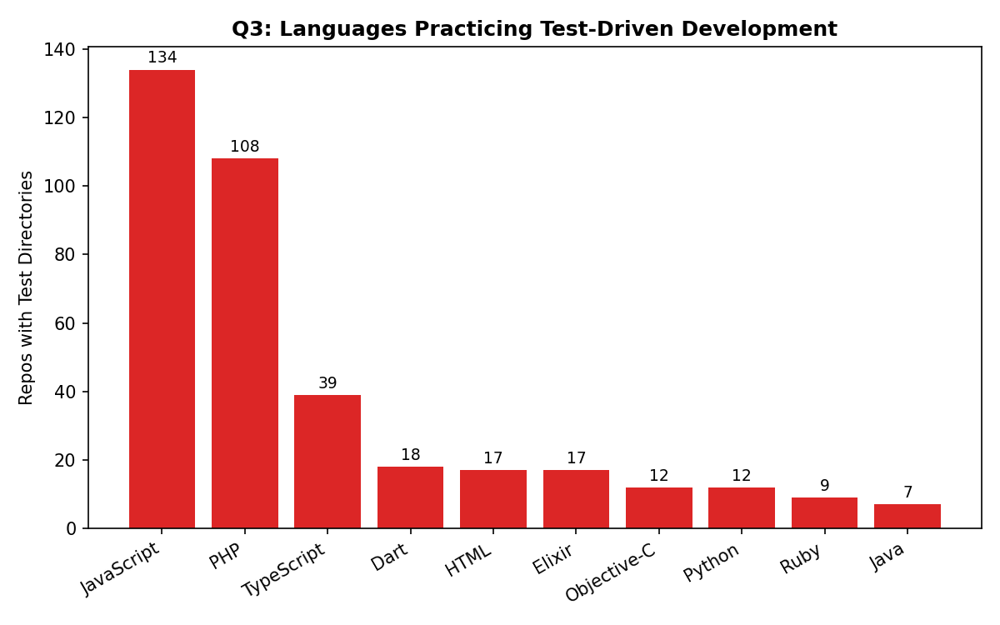
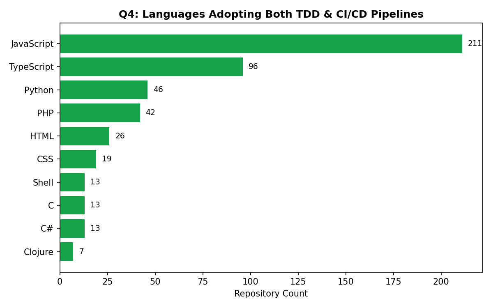

# GitHub Analytics: Real-Time Streaming Pipeline

**Team project (5 members)** — Uppsala University, Data Engineering II, Spring 2026
*Source code is kept private per course policy (the pipeline uses authenticated GitHub API credentials). This write-up mirrors our final report's structure — no code or credentials included.*

## 1. Introduction

GitHub's standard search doesn't support deep analytics on repository trends — identifying the most popular languages, or which ecosystems most rigorously apply testing and CI/CD. This project builds an analytical pipeline using Apache Pulsar, a scalable low-latency streaming framework, to process GitHub REST API metadata for repositories updated or created in the last year. The system is deployed as a distributed microservices architecture across 5 OpenStack VMs via Docker Compose for high throughput and fault tolerance.

## 2. Related Work

Existing GitHub analytics tools like GHTorrent and GitHub Archive rely on offline batch processing and periodic database dumps, making them unsuited for real-time analysis. Apache Pulsar was chosen over alternatives like Kafka for its decoupled compute/storage layers and Shared subscription model, enabling multiple consumers to process the same data stream in parallel.

## 3. System Architecture

**3.1 Cloud Deployment and Orchestration** — The system runs across 5 independent OpenStack VMs: a Master Node hosting the Pulsar broker, an Ingestion Node isolating the GitHub crawling logic, and three Worker Nodes, each running a dedicated Python consumer container via Docker Compose.

**3.2 Data Ingestion and Fault Tolerance** — GitHub's Search API caps results at 1,000 per query. To capture up to ~365,000 repositories/year without hitting that ceiling, ingestion uses day-by-day paginated queries. A custom rate limiter reads GitHub's rate-limit response headers and pauses the pipeline exactly until quota resets, avoiding API bans or container crashes.

**3.3 Shared Topic Architecture** — Rather than a layered topic chain, the system uses a single raw metadata topic with Pulsar's Shared subscription mode, letting three independent consumers process the same stream in parallel: Consumer 1 (Q1/Q2 — language counts and commit history), Consumer 2 (Q3 — unit test detection), Consumer 3 (Q4 — tests + CI/CD detection).

## 4. Results

**4.1 Quantifying the Four Questions**

| Question | What it measures |
|---|---|
| Q1 | Top languages by project count |
| Q2 | Most-updated projects by commit frequency |
| Q3 | Languages practicing TDD |
| Q4 | Languages combining TDD + CI/CD |

**My contribution: Q3 Consumer (Worker Node VM4)** — I built and deployed the consumer that inspects each repository's file tree for unit test directories, aggregating results by language to surface TDD adoption trends.

**4.2 Interesting Findings** — JavaScript and TypeScript dominate not just in raw project count (Q1) but also in combined TDD + CI/CD maturity (Q4: 211 and 96 repos respectively) — modern web frameworks bake testing scaffolds and automation into their default project setup, unlike traditional backend languages like Java, which ranked far lower on TDD adoption (Q3).

**4.3 Adaptive Design for New Queries** — Consumers read their aggregation depth (`TOP_N`) from environment config rather than hardcoded values, so changing "top 10" to "top 20" only requires an env variable update and container restart, not a source code change.

## Tech Stack

Apache Pulsar · Docker Compose · Python · GitHub REST API · OpenStack

## References

- [GitHub Search API](https://docs.github.com/en/rest/search/search#search-repositories)
- [GitHub Rate Limits](https://docs.github.com/en/rest/using-the-rest-api/rate-limits-for-the-rest-api)
- [Apache Pulsar Documentation](https://pulsar.apache.org/docs/)
